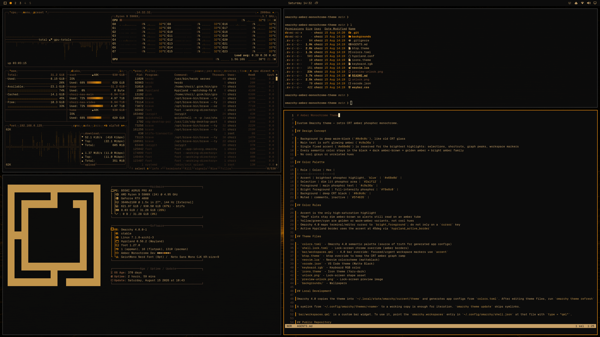

# Amber Monochrome

**Retro CRT screen amber monochrome** theme for [Omarchy](https://omarchy.org/).

Inspired by classic amber phosphor CRT terminals (old Wyse, DEC, IBM 5151-style monitors). Deep warm-black background, soft glowing amber text, and a single bright accent (#e68e0d) used for the most intense highlights — exactly like an old amber monitor at night.




## Design Goals

- **Retro CRT aesthetic**: Very dark warm-black background (#0c0c0c) that feels like old CRT glass with slight phosphor haze.
- **Amber phosphor text**: Main foreground is a soft glowing amber (#c9a36a), not cool gray or pure white. This is the characteristic "lit phosphor" look.
- **Single bright accent** (`#e68e0d`): Kept exactly as the punchy, saturated highlight color for selections, keyboard shortcuts, graph peaks, and bright UI elements. This is the "full intensity" part of the phosphor.
- **Strict amber family only**: The semantic palette lives in black → dark amber-brown → golden → bright amber. No cool grays, no blues, no saturated reds. "Red" positions are mapped to dim warm browns that still read as alerts on an amber screen.

## Color Palette

| Role                    | Color                  | Hex       |
|-------------------------|------------------------|-----------|
| Accent / Bright highlights | Punchy amber (exact) | `#e68e0d` |
| Foreground (main text)  | Soft phosphor amber    | `#c9a36a` |
| Bright foreground       | Full-intensity phosphor | `#f8e8c0` |
| Background              | Deep CRT black         | `#0c0c0c` |
| Selection               | Dim lit phosphor area  | `#2a1f12` |

Omarchy 4.0 generates terminal ANSI colors from this semantic palette. The whole set stays in the amber phosphor family.

## Theme Files

- `colors.toml` — Omarchy 4.0 semantic palette
- `shell.lock.toml` — Lock-screen chrome (amber borders)
- `bar/workspaces.qml` — Active/urgent workspace markers use accent
- `btop.theme` — Warm brown boxes + bright amber data highlights
- `icons.theme` — Yaru-dark
- `neovim.lua` — Neovim base (matteblack.nvim)
- `vscode.json` — VS Code recommendation (Matte Black)
- `keyboard.rgb` — RGB keyboard uses the accent (`e68e0d`)
- `unlock.png` — Solid bright amber (lock screen shape)
- `preview.png` — Desktop preview
- `preview-unlock.png` — Lock screen preview
- `backgrounds/` — Dark moody wallpapers (from original Matte Black)

## Installation

```bash
omarchy theme install https://github.com/chorr/omarchy-amber-monochrome-theme.git
```

After editing a local checkout, apply with `omarchy theme set amber-monochrome` or `omarchy theme refresh`. A symlink from `~/.config/omarchy/themes/<name>` to the working copy is enough for iteration.
