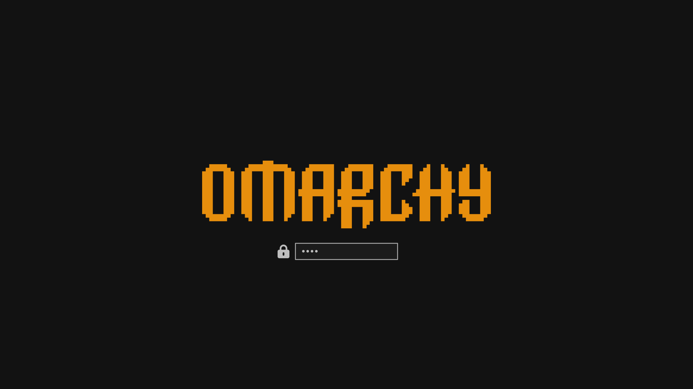

# Amber Monochrome

**Retro CRT screen amber monochrome** theme for [Omarchy](https://omarchy.org/).

Inspired by classic amber phosphor CRT terminals (old Wyse, DEC, IBM 5151-style monitors). Deep warm-black background, soft glowing amber text, and a single bright accent (#e68e0d) used for the most intense highlights — exactly like an old amber monitor at night.



## Design Goals

- **Retro CRT aesthetic**: Very dark warm-black background (#0c0c0c) that feels like old CRT glass with slight phosphor haze.
- **Amber phosphor text**: Main foreground is a soft glowing amber (#c9a36a), not cool gray or pure white. This is the characteristic "lit phosphor" look.
- **Single bright accent** (`#e68e0d`): Kept exactly as the punchy, saturated highlight color for selections, keyboard shortcuts, cursor glow, graph peaks, and bright UI elements. This is the "full intensity" part of the phosphor.
- **Strict amber family only**: The entire 16-color ANSI palette lives in black → dark amber-brown → golden → bright amber. No cool grays, no blues, no saturated reds. "Red" positions are mapped to dim warm browns that still read as alerts on an amber screen.

## Color Palette

| Role                    | Color                  | Hex       |
|-------------------------|------------------------|-----------|
| Accent / Bright highlights | Punchy amber (exact) | `#e68e0d` |
| Cursor                  | Glowing bright amber   | `#f5d48a` |
| Foreground (main text)  | Soft phosphor amber    | `#c9a36a` |
| Background              | Deep CRT black         | `#0c0c0c` |
| Selection background    | Dim lit phosphor area  | `#2a1f12` |
| Selection foreground    | Bright warm            | `#f0d090` |

### Terminal ANSI (colors 0-15)

Fully mapped to the amber phosphor family:

- Blacks (0, 8): deep warm blacks (`#1a120c`, `#251a12`)
- "Reds" (1, 3, 5, 9, 11, 13): dark-to-mid amber-browns (`#7a4a28` … `#a07048`) — low saturation, still feels "alert" on old monitors
- "Yellows" / brights (2, 4, 10, 12): golden to the exact accent `#e68e0d` and its bright variant `#f5a630`
- "Cyans/Magentas" (6, 13, 14): warm amber-grays
- Bright text (7, 15): soft to very bright phosphor (`#c9a36a` → `#f8e8c0`)

The result feels like the whole terminal is being rendered on a single old amber CRT tube.

## Theme Files

- `colors.toml` — Terminal + system colors (core retro CRT palette)
- `btop.theme` — btop++ styled with warm brown boxes + bright amber data highlights
- `icons.theme` — Yaru-red (subtle warmth)
- `neovim.lua` — Neovim base (matteblack.nvim as starting point; real phosphor look would need a dedicated amber colorscheme)
- `vscode.json` — VS Code recommendation
- `keyboard.rgb` — RGB keyboard uses the accent (`e68e0d`)
- `unlock.png` — Solid bright amber (lock screen shape)
- `preview-unlock.png` — Lock screen preview
- `backgrounds/` — Dark moody wallpapers (from original Matte Black)
- `preview.png` — Desktop preview (update this after applying the new palette)

## Installation

```bash
omarchy theme install https://github.com/chorr/omarchy-amber-monochrome-theme.git
```

Local development / testing:

```bash
mkdir -p ~/.config/omarchy/themes/amber-monochrome
cp -r ~/workspace/omarchy-amber-monochrome-theme/* ~/.config/omarchy/themes/amber-monochrome/
omarchy theme set amber-monochrome
omarchy restart terminal
```

## Credits

- Original structure & wallpapers: Matte Black by [tahayvr](https://github.com/tahayvr)
- Retro CRT amber inspiration: classic phosphor terminal aesthetics (Wyse, DEC VT, IBM 5151 amber variants)
- Omarchy theme system: [Omarchy](https://omarchy.org/)
